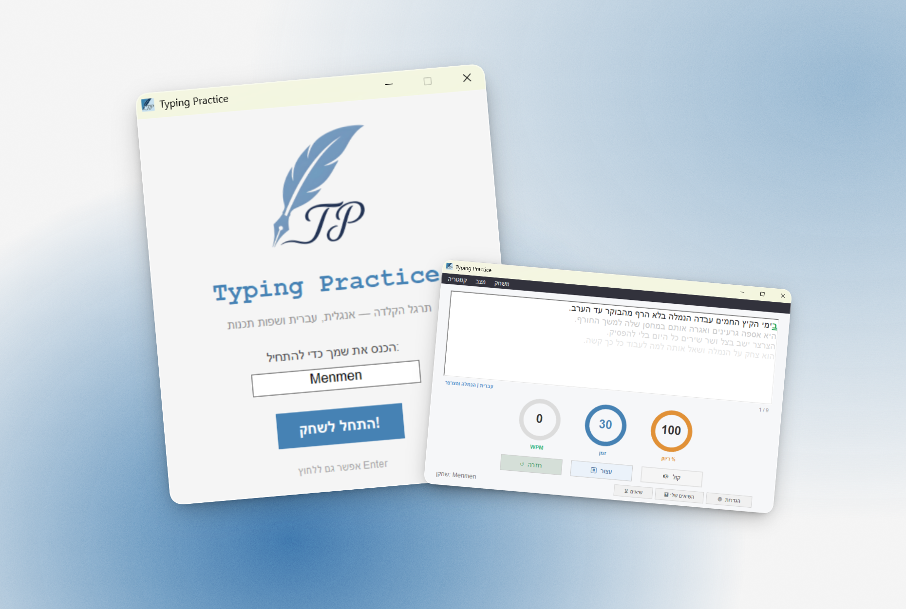

# Typing Practice

<p align="center">
  
</p>

אפליקציית הקלדה ב-**C# / Windows Forms** (.NET 4.7.2).  
בוחרים שפה, רמת קושי וזמן — ומתרגלים עם מדידת WPM, דיוק, צלילים ושמירת שיאים.

<p align="center">
  
</p>

---

## מה האפליקציה עושה

- משפטים, קטעי ספרות וג'יבריש — בעברית, אנגלית ושפות קוד
- רמות קושי: קל / בינוני / קשה
- תצוגת שורות: 2 למעלה, נוכחית, 3 למטה
- טיימר, WPM ודיוק בזמן אמת
- צלילים להקלדה (אות / רווח / שגיאה)
- טופ 10 כללי + דף **השיאים שלי** לכל שחקן

---

## ארכיטקטורה (בקצרה)

```
Form1 (UI)  →  GameManager  →  TextLibrary  →  texts/
            →  SoundManager  →  sound/
            →  ScoreStore    →  scores.dat / my_scores.dat
```

| קובץ | תפקיד |
|------|--------|
| `Form1.cs` | מסך ראשי, ציור טקסט, קלט, טיימרים |
| `GameManager.cs` | לוגיקת משחק, WPM, דיוק, מעבר שורות |
| `TextLibrary.cs` | טעינת טקסטים לפי מצב ורמה |
| `SoundManager.cs` | סאונד עם NAudio |
| `ScoreStore.cs` | שמירת שיאים |

---

## בעיות שעלו ואיך פתרתי

| בעיה | פתרון |
|------|--------|
| צלילים נעלמים בהקלדה מהירה | NAudio + מיקסר במקום `PlaySound` |
| ריצוד בטקסט | `DoubleBuffered` + `WM_SETREDRAW` |
| Enter לא עבד אחרי טעויות | מעבר שורה לפי אורך, לא התאמה מלאה |
| טעויות נמחקו בשורות למעלה | שמירת `lineHistory` עם מה שהוקלד |
| טבלת שיאים לא מסודרת | `DataGridView` ממורכז, גודל אחיד, בלי גלילה |

---

## הרצה

Visual Studio → פתח `TypingPractice.sln` → Build → F5

---

## רישיון

Private project © menmen770
